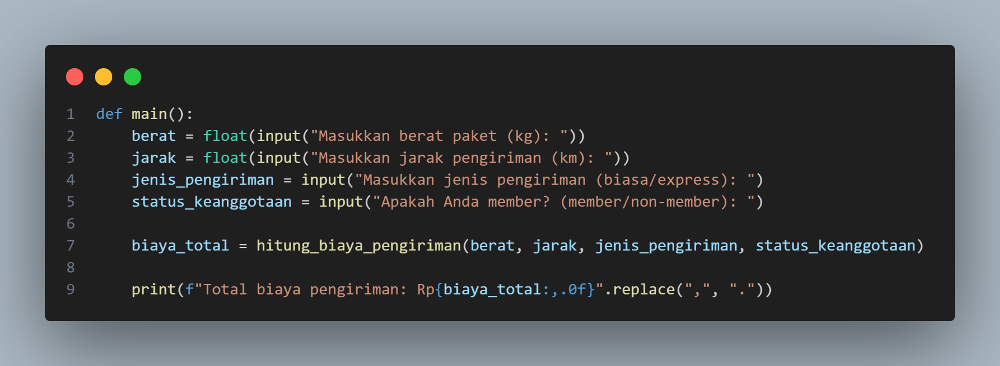
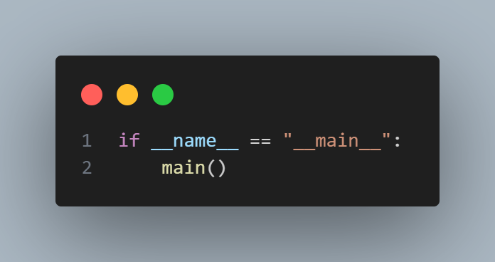
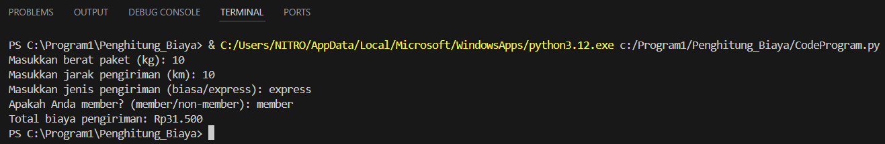

#  Program Penghitung Biaya Pengiriman

## Deskripsi
Program ini digunakan untuk menghitung total biaya pengiriman berdasarkan berat paket, jarak pengiriman, jenis pengiriman (biasa atau express), serta status keanggotaan pelanggan (member atau non-member). Biaya dihitung berdasarkan aturan tertentu yang telah ditentukan.

## Fitur
- Menginput berat paket (kg)

- Menginput jarak pengiriman (km)

- Memilih jenis pengiriman (biasa/express)

- Memilih status keanggotaan (member/non-member)

- Menampilkan total biaya pengiriman dengan format yang rapi

## Penjelasan Kode

### Fungsi Hitung Biaya Pengiriman

[!](/Gambar/gambar1.png)

Penjelasan:

- Fungsi ini menerima empat parameter: berat, jarak, jenis_pengiriman, dan status_keanggotaan.

- Biaya dasar ditetapkan sebesar Rp10.000.

- Jika berat lebih dari 5kg, dikenakan tambahan Rp5.000.

- Jika jarak lebih dari 10km, dikenakan tambahan Rp8.000.

- Jika pengiriman express, dikenakan tambahan Rp20.000.

- Jika pengguna adalah member, mendapat diskon 10%.

- Fungsi mengembalikan total biaya sebagai integer.

### Fungsi Main

Penjelasan:

- Fungsi ini meminta input dari pengguna terkait berat paket, jarak, jenis pengiriman, dan status keanggotaan.

- Kemudian memanggil fungsi hitung_biaya_pengiriman untuk menghitung total biaya.

- Hasil biaya pengiriman ditampilkan dalam format yang rapi dengan titik sebagai pemisah ribuan.

### Pemanggilan Fungsi Utama

Penjelasan:

- Menjalankan fungsi main() jika skrip dieksekusi secara langsung.

- Ini memastikan kode tidak dijalankan saat file di-import sebagai modul.

## Contoh Output

